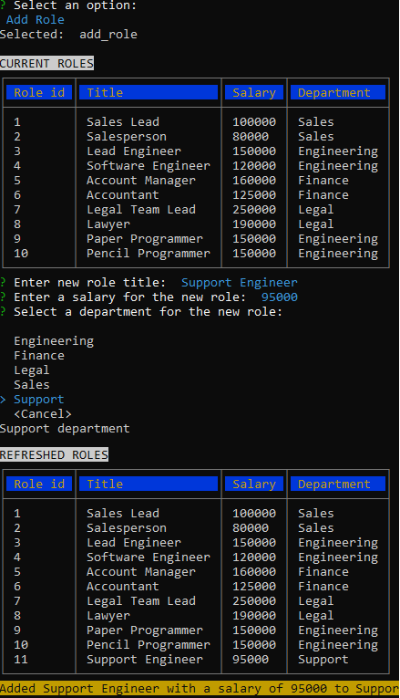

# Employee Tracker


## Description

This is an employee tracker, demonstrating a command-line NodeJS application to manage data on a MySQL database.

## Repository

[https://github.com/andrenrwn/employeetracker](https://github.com/andrenrwn/employeetracker)

## Installation

- nodeJS (if not yet installed)
- clone this repository
- npm install

## Usage

Local run:

```$ node index.js```

### Main Menu

The program presents the user with the following options.


Use the up and down arrow to select an option.
Press <enter> to select.

A <cancel> selection will back out to the main menu.

Selecting quit will exit the program.

### View Department

View all departments.


### View Department Employees

Select a department to view that department's employees.


### View the personnel budget of each department 

View the sum of all salaries of employees that belong to each department.
The table also displays an employee count of each department.


### Add a department

Enter the department's name when prompted.


### Delete a department


### View All Roles

View all employee titles (roles)


### Add Role

Add an employee role (title), 
enter the role's salary,
then select a department that hosts that role.



Salary only accepts numeric entries.


### Delete Role

Select a role to delete it.
If an employee is currently assigned the deleted role, the employee's role will be NULL.


### View Employees

Views all employees, their roles, salaries, and manager (if assigned).


### View Employees by Manager

View all employees, sorted by their manager in charge.
An employee can have multiple managers, in which case that employee will be displayed twice in the table so all their managers can be displayed.


### View Manager Direct Reports

Select a manager to view their direct reports.


### Add Employee

Add an employee.
Enter their first name, last name, and select their work role.


### Update Employee Role

Update the employee's role.
Select the employee to update, then select a new role for that employee.


### Modify Employee Manager

You can assign a new manager to an employee, or remove the manager assignment from an employee.


### Delete Employee

You can also delete an employee from the database.


## License

[MIT](LICENSE)

## Dependencies and Credits

The following are the npm dependencies of this application:

- inquirer  : https://github.com/SBoudrias/Inquirer.js
- mysql2    : https://github.com/sidorares/node-mysql2
- cli-table : https://github.com/Automattic/cli-table
- colors    : https://github.com/Qix-/color

Ideas and code patterns are provided from the UT Austin Coding Bootcamp challenges.
